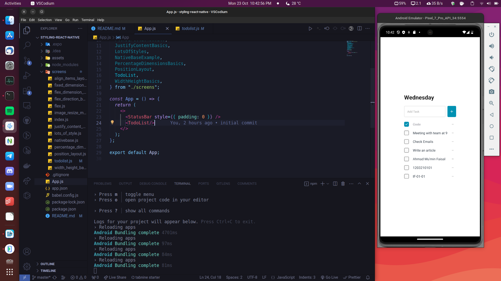
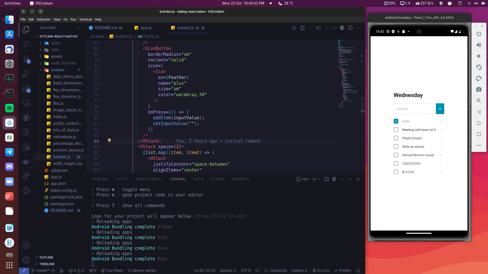

# Laporan Praktikum Modul 5 : Styling React Native

| Nama | Ahmad Mu'min Faisal |
| -- | -- |
| NIM | 1203210101 |
| Kelas | IF-01-01 |

## 1. Persiapan 

Buat sebuah project Expo dengan perintah:

```bash
npx create-expo-app styling-react-native
```

Masuk ke direktori project:

```bash
cd styling-react-native
```

Setelah itu, jalankan project Expo dengan perintah:

```bash
npm run android
```

Dengan ini, project awal Expo berhasil dijalankan.

# 2. Source Code

### 2.1 App

File `App.js` merupakan root component ketika aplikasi Expo dijalankan. Komponen ini berisi komponen `StatusBar` dan `TodoList` yang posisinya vertikal satu sama lain.

File `App.js`:

```jsx
import React from "react";
import { StatusBar } from "react-native";
import {
  AlignItemsLayout,
  DirectionLayout,
  DisplayAnImageWithStyle,
  FixedDimensionsBasics,
  Flex,
  FlexDimensionsBasics,
  FlexDirectionBasics,
  JustifyContentBasics,
  LotsOfStyles,
  NativeBaseExample,
  PercentageDimensionsBasics,
  PositionLayout,
  TodoList,
  WidthHeightBasics,
} from "./screens";

const App = () => {
  return (
    <>
      <StatusBar style={{ padding: 0 }} />
      <TodoList/>
    </>
  );
};

export default App;
```

# 2.2 Komponen-Komponen

# 2.2.1 TodoList

Komponen `TodoList` merupakan komponen yang berisi aplikasi sederhana Todo List. Pada komponen ini, secara umum terdiri dari 3 bagian, yaitu:

1. Heading: komponen ini hanya berisi komponen `Heading` yang bertuliskan teks "Wednesday".
2. Body: komponen ini dibungkus oleh komponen `VStack` yang terdiri dari dari 2 child component, yaitu bagian Input dan List Item.

Komponen yang pertama dalam Body berupa komponen `HStack` yang berisi `Input` dan `IconButton`. Komponen `Input` diisi kemudian `IconButton` ditekan, maka aplikasi akan menjalankan handler `addItem` yang dapat menambahkan item ke bagian List Item sekaligus memperbarui state aplikasi.

Sedangkan, komponen yang kedua dalam Body berupa komponen `VStack` yang berisi kolom dari data di List Item. Setiap item dapat di-klik sehingga menampilkan centang dari checkbox bahwa Item telah dipilih. Apabila tombol `-` di-klik, maka Item yang berkaitan akan terhapus sekaligus memperbarui state aplikasi.

File `screens/todolist.js`:

```jsx
import React from "react";
import {
  Input,
  Button,
  IconButton,
  Checkbox,
  Text,
  VStack,
  HStack,
  Heading,
  Icon,
  Center,
  Box,
  NativeBaseProvider,
} from "native-base";
import { FontAwesome5, Feather, Entypo } from "@expo/vector-icons";

const TodoList = () => {
  const initState = [
    { title: "Code", isCompleted: true },
    { title: "Meeting with team at 9", isCompleted: false },
    { title: "Check Emails", isCompleted: false },
    { title: "Write an article", isCompleted: false },
  ];
  const [list, setList] = React.useState(initState);
  const [inputValue, setInputValue] = React.useState("");

  const addItem = (title) => {
    setList([
      ...list,
      {
        title: title,
        isCompleted: false,
      },
    ]);
  };

  const handleDelete = (index) => {
    const temp = list.filter((_, itemI) => itemI !== index);
    setList(temp);
  };

  const handleStatusChange = (index) => {
    const temp = list.map((item, itemI) =>
      itemI !== index
        ? item
        : {
            ...item,
            isCompleted: !item.isCompleted,
          }
    );
    setList(temp);
  };

  return (
    <NativeBaseProvider>
      <Center flex={1}>
        <Box>
          <Heading mb="5">Wednesday</Heading>
          <VStack space={4}>
            <HStack space={2}>
              <Input
                flex={1}
                onChangeText={(v) => setInputValue(v)}
                value={inputValue}
                placeholder="Add Task"
              />
              <IconButton
                borderRadius="sm"
                variant="solid"
                icon={
                  <Icon
                    as={Feather}
                    name="plus"
                    size="sm"
                    color="warmGray.50"
                  />
                }
                onPress={() => {
                  addItem(inputValue);
                  setInputValue("");
                }}
              />
            </HStack>
            <VStack space={2}>
              {list.map((item, itemI) => (
                <HStack
                  justifyContent="space-between"
                  alignItems="center"
                  key={item.title + itemI.toString()}
                >
                  <Checkbox
                    isChecked={item.isCompleted}
                    onChange={() => handleStatusChange(itemI)}
                    value={item.title}
                  >
                    <Text
                      mx="2"
                      strikeThrough={item.isCompleted}
                      _light={{
                        color: item.isCompleted ? "gray.400" : "coolGray.800",
                      }}
                      _dark={{
                        color: item.isCompleted ? "gray.400" : "coolGray.50",
                      }}
                    >
                      {item.title}
                    </Text>
                  </Checkbox>
                  <IconButton
                    size="sm"
                    colorScheme="trueGray"
                    icon={
                      <Icon
                        as={Entypo}
                        name="minus"
                        size="xs"
                        color="trueGray.400"
                      />
                    }
                    onPress={() => handleDelete(itemI)}
                  />
                </HStack>
              ))}
            </VStack>
          </VStack>
        </Box>
      </Center>
    </NativeBaseProvider>
  );
};

export default TodoList;
```


# 3. Dokumentasi Output

## 3.1 App.js



## 3.2 todolist.js

